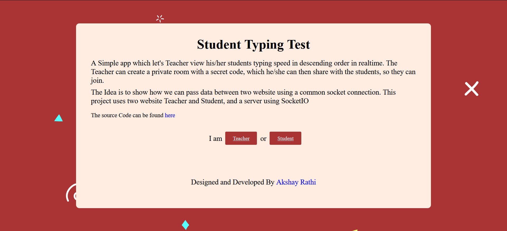
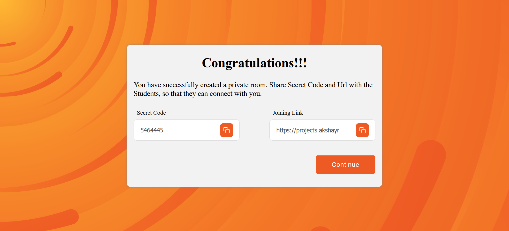
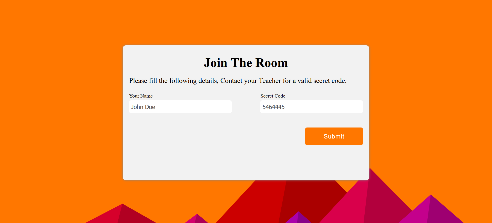

# Socket.io Project

A SocketIo app which enables a Teacher to create password protected private server through which he/she can connect with his/her students to view their typing speed(WPM) in real time. The Idea is to connect two website and pass data between them using socket Io.<br>
The Project is live at <a href="https://projects.akshayrathi.com/socket-io-app/" target="_blank">link</a>

## Project Screen Shot(s)







## Installation and Setup Instructions

Clone down this repository. You will need `node` and `npm` installed globally on your machine.

Installation:

```
npm install
```

To Start Server:

```
node server.js
```

To Visit App:

```
localhost:4001
```

## Built With

The project has been build using below frameworks and tools:

- [Html/CSS](https://developer.mozilla.org/en-US/)
- [Javascript](https://developer.mozilla.org/en-US/)
- [SocketIo](https://socket.io/)

## Authors

Designed And Developed By [Akshay Rathi](https://akshayrathi.com)

<p><a href="https://akshayrathi.com/" target="_blank"></a>&nbsp;&nbsp;&nbsp;&nbsp;<a href="https://projects.akshayrathi.com/" target="_blank"></a>&nbsp;&nbsp;&nbsp;&nbsp;<a href="https://www.linkedin.com/in/akshay-rathi-sde/" target="_blank"></a>&nbsp;&nbsp;&nbsp;&nbsp;
</p>
